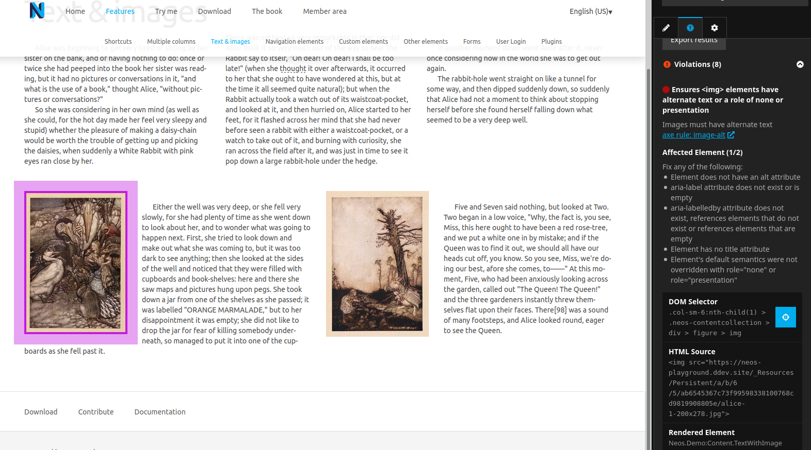
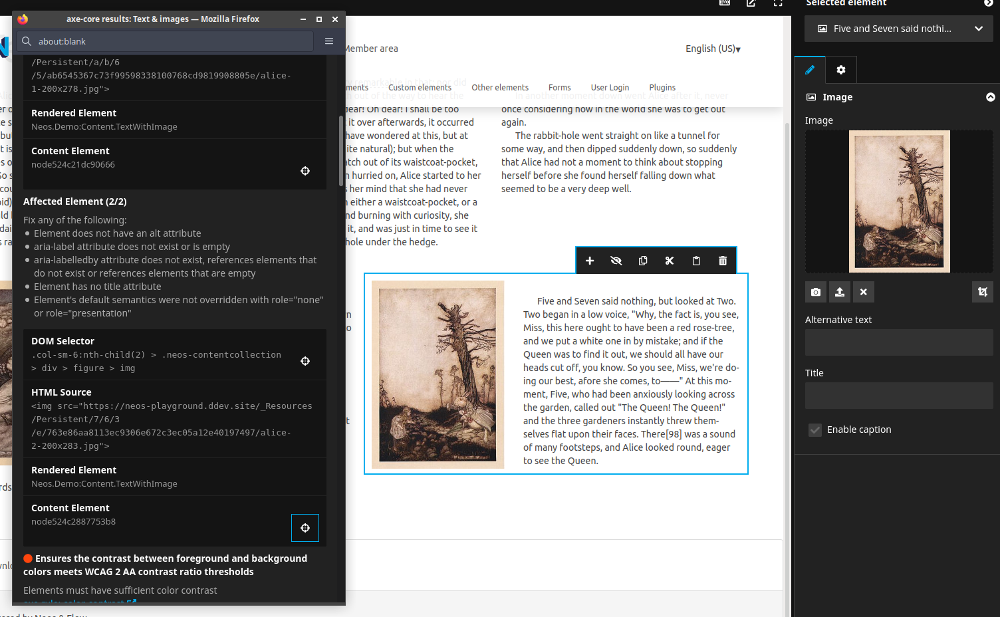

# Prgfx.Neos.AxeCore

This package integrates the [axe-core](https://github.com/dequelabs/axe-core) accessibility analysis tools from [Deque](https://www.deque.com/) into the Neos inspector to allow editors to quickly determine accessibility issues on a document.

`composer require prgfx/neos-axecore`

The development of this package is supported by [mindscreen GmbH](https://mindscreen.de).

## Features
* Run axe-core analyzer for the current document and display accessibility errors in the inspector
  
* Highlight affected DOM nodes and select content-elements if available
* Pop-out results as separate window to keep errors open while fixing them
  
* Localized results based on user-preferences and translations provided by the axe-core project
* Export results for developers/integrators


## Configuration

### axe.run Options
You can specify the options passed to `axe.run` through the settings:
```yaml
Neos:
  Neos:
    Ui:
      frontendConfiguration:
        Prgfx.Neos.AxeCore:runOptions:
          runOnly:
            type: 'rule'
            values: ['ruleId1', 'ruleId2', 'ruleId3']
```

### Override used resources
If you want to use a specific (compatible) version of the axe-core library, you can override
```yaml
Prgfx:
  Neos:
    AxeCore:
      script: 'resource://My.Package/Public/Path/To/axe.js'
      translations: 'resource://My.Package/Private/Path/To/locales/{language}.json'
```
By specifying a json without the `{language}` placeholder you could disable localization of the results.

## Feature-Flags
Some features may still be experimental or not suited for all users.

### Configure Feature-Flags
Feature-flags can be enabled, disabled or configured based on conditions.
```yaml
Neos:
  Neos:
    Ui:
      frontendConfigurations:
        Prgfx.Neos.AxeCore:features:
          feature1: true
          feature2: false
          feature3: ${Security.hasRole('Neos.Neos:Administrator')}
```

### Available Feature-Flags
| name | default value | description |
|---|:---:|---|
| popout | `true` | enable button to pop-out the results in the inspector into a separate window |
| export | `true` | enable button to download the test-results as JSON file |


## Development

### Updating axe-core
When updating axe-core, make sure to update both the translations and distribution js shipped with this version.
The package file includes two helpers to copy these files to their respective target locations.
```bash
cd Resources/Private/JavaScript/AxeCoreView &&\
  yarn upgrade axe-core &&\
  yarn run export-translations &&\
  yarn run export-axejs
```

## Notes
To work out of the box, this package includes a built version of axe-core and the locales distributed with it.
The sources are available [on GitHub](https://github.com/dequelabs/axe-core) and licensed under the [MPL-2.0 License](./Documentation/Licenses/axe-core).
